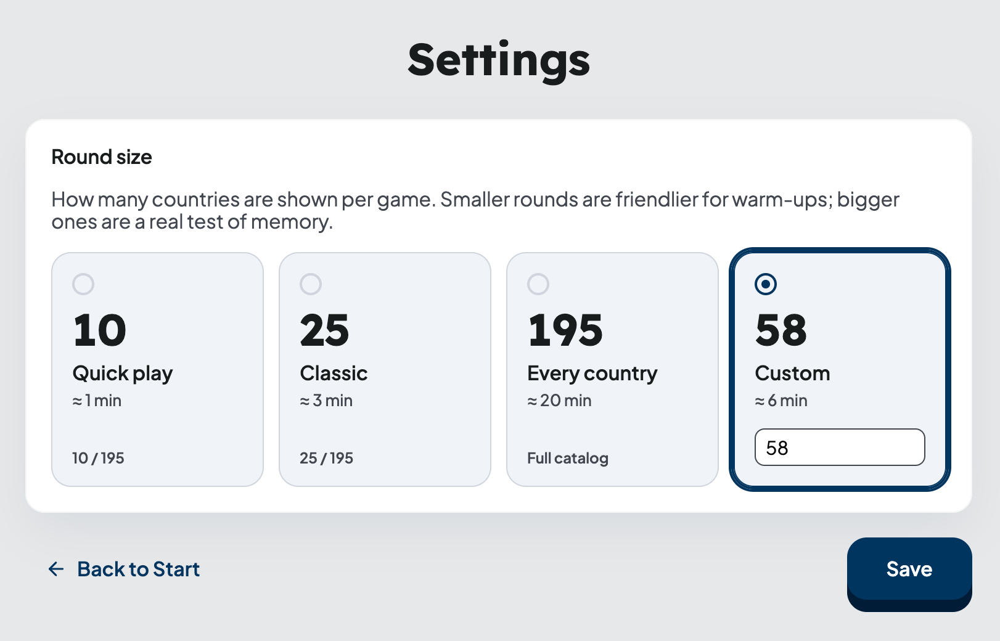

## Introduction

It's convenient but fragile to implement a feature in a single chat session: first you discuss, then you write code, then you fix CI in the same window. The context inflates quickly, and on a very long window (100k tokens and above) the model remembers earlier agreements worse and makes more mistakes.

The main thesis of this article is simple: an agent does well where decisions have already been made and written down, the context of each iteration is small, and the state of the work lives outside the agent — in an issue tracker or files, not in its memory. Below is a plan for taking a feature from idea to PR while respecting these constraints.

This approach is meant for substantial features and ideas — where there's something to discuss, pin down, and break into pieces. For a simple bugfix, typo, small refactor, or one-line change, there's no point running the full cycle; the agent already knows what to do.

## Workflow

My workflow is largely based on the approach of [Matt Pocock](https://github.com/mattpocock) and his set of skills: the sequence of steps from idea to final PR is already baked in, and I lean on it as is.

I'll walk through each step using a small pet project [geo-quiz](https://github.com/romankrru/geo-quiz) as an example. My stack is tied to Claude Code and GitHub, but the techniques themselves aren't about a specific tool: they can be reproduced with any AI coding agent (for example, OpenCode) and with local files instead of GitHub issues.

Before going through each step — an important caveat. I rarely work this way end-to-end. More often I take individual skills and run them manually: more control, easier to debug, you can see how everything works inside, and it's easier to adapt to yourself. If a piece is inconvenient — it's not scary to replace or drop it. Below is the maximal version; each part of it works on its own too.

## Example feature

In a small [flag quiz game](https://geo-quiz-phi.vercel.app/), we need to add a settings screen (`/settings`): the player sets the number of questions per round — presets (10, 25, all countries in the catalog) or a custom number; the choice is saved in `localStorage` and applied when the next round starts.



## Capturing requirements

At this stage Matt Pocock has two related skills:

- [`/grill-me`](https://github.com/mattpocock/skills/blob/main/skills/productivity/grill-me/SKILL.md) — the agent interviews you along a plan, walking through branches of a decision tree until each one resolves.
- [`/grill-with-docs`](https://github.com/mattpocock/skills/blob/main/skills/engineering/grill-with-docs/SKILL.md) — the same interview, but additionally the agent reconciles the plan with the existing domain model, clarifies terminology, and updates `CONTEXT.md` and ADRs (_Architectural Decision Record_) along the way.

If we're talking about a project with a codebase — you should almost always take `/grill-with-docs`. Historically `/grill-me` came first — a skill that became viral on its own. But over time Matt noticed that he regularly lacked a shared language with the agent (in [DDD](https://en.wikipedia.org/wiki/Domain-driven_design) this is _ubiquitous language_, UL): grilling sessions surfaced recurring terms, but they weren't recorded anywhere, and next time he had to articulate them again. First he ran a second skill `/ubiquitous-language` in parallel, which extracted terms into a separate glossary, and then he merged the two into one — that's how `/grill-with-docs` was born.

In geo-quiz I run exactly that one. A copy of the skill lives in the repository — [`/grill-with-docs`](https://github.com/romankrru/geo-quiz/tree/main/.agents/skills/grill-with-docs). After that everything is standard: I describe the idea to the agent, invoke the skill, and it starts to clarify details and capture every meaningful decision. In parallel, the agent edits [`CONTEXT.md`](https://github.com/romankrru/geo-quiz/blob/main/CONTEXT.md) at the repository root.

`CONTEXT.md` is the project glossary: it holds the definitions of key terms. The idea is borrowed from DDD: one of its central concepts is _ubiquitous language_, a single language spoken by three sides — the code, the developers, and the domain experts. When all three call the same things by the same names, a whole class of errors disappears: in conversation the entity is called one thing, in the ticket — another, in the code — a third.

For an agent the effect is exactly the same as for a new person on the team: instead of figuring out every time what, for example, a "round" or a "preset" is, it checks `CONTEXT.md` and immediately uses the established term. Names in the code and in the PR match the glossary, and the agent's responses become shorter.

In large repositories a single glossary file can stop coping: the same term in different parts of the system may denote different entities with different rules. For this case DDD has _bounded context_ — an explicit boundary inside which the language is consistent. Matt uses `CONTEXT-MAP.md` at the root for such repos: it contains no definitions itself, only a map showing which contexts exist in the project and where each has its own `CONTEXT.md`.

```
/
├── CONTEXT-MAP.md
├── docs/adr/                # system-wide decisions
└── src/
    ├── ordering/
    │   ├── CONTEXT.md
    │   └── docs/adr/        # decisions inside the context
    └── billing/
        ├── CONTEXT.md
        └── docs/adr/
```

In a small project all of this is overkill — a single `CONTEXT.md` at the root is enough. In a large product `CONTEXT-MAP.md` is justified: it tells the agent (and the human) which glossary to go to for a term, and prevents mixing languages from different contexts.

Besides `CONTEXT.md`, `/grill-with-docs` sometimes suggests creating an ADR — a separate markdown file in `docs/adr/`. An ADR is created if three conditions are met: the decision is hard to roll back, it looks strange without context, and it involves some kind of trade-off. Such documents are deliberately few.

In my experience, AI can fill `CONTEXT.md` with plausible-looking slop. So this stage puts a lot of responsibility on the developer. And code review won't easily catch it: the reviewer needs domain knowledge and immersion to spot the problem.

## Creating a PRD

Once the glossary has settled and the debatable decisions are captured in ADRs, the idea is ready to be translated into a formal document — a PRD (Product Requirements Document).

A PRD is a short document describing one feature: goal, use cases, _scope_ (what's in and what's **not** in), _acceptance criteria_. Unlike `CONTEXT.md`, which describes the domain language as a whole, a PRD is always tied to one specific feature.

A PRD is created with the [`/to-prd`](https://github.com/romankrru/geo-quiz/tree/main/.agents/skills/to-prd) skill — this skill takes the chat context and creates a PRD from a template, then publishes it on GitHub. An example of such a PRD: [issue #13 — Configured round size (settings page)](https://github.com/romankrru/geo-quiz/issues/13).

The document itself isn't stored in the repository — it only lives as a GitHub issue. After creating the PRD I skim the resulting artifact. Matt in his video [says](https://youtu.be/-QFHIoCo-Ko?si=N152Z33k8J9LlNGP&t=2114) that he doesn't do this: shared context with the agent, in his words, has already been reached at the `/grill-with-docs` stage, and the PRD here is needed more as a fixation point than as something to be agreed upon.

## Slicing into tasks

The [`/to-issues`](https://github.com/romankrru/geo-quiz/tree/main/.agents/skills/to-issues) skill splits a large PRD into small tasks. Each of these tasks:

- Is self-contained — you can take it, implement it, and merge it.
- Is a _vertical slice_ (_tracer bullet_) — a thin cut through all layers (model, service, UI, tests), not "the whole backend first, then the whole frontend."
- Is marked as AFK (can be handed to an agent) or HITL (requires a human — for example, a design decision or an architectural choice).

The agent shows the proposed split, gets feedback, iterates, and then publishes child issues on GitHub with the `ready-for-agent` label — by this label the ralph loop later picks them up (see below).

All issues belonging to one PRD are tagged with labels:

- `prd` — this label is only put on the PRD issue itself.
- `prd-<N>`, where `<N>` is the number of the PRD issue. This label is put on both the PRD itself and all its child issues.

This scheme is needed so that later one query can find all child issues belonging to a PRD.

An example of one such "child": [issue #14 — Configured round size: Quiz preferences store and round-start resolution](https://github.com/romankrru/geo-quiz/issues/14).

After this step, in GitHub I have: one PRD issue with several child issues attached to it, all with the right labels.

## ralph loop

ralph loop is a very simple loop:

```sh
while not done:
    agent_step()
```

The name was coined by [Geoffrey Huntley](https://ghuntley.com/ralph/) — it's a reference to Ralph Wiggum from The Simpsons. The character is dim but persistent: does the same thing over and over and isn't discouraged by failure. The loop behaves the same way — the same prompt, different code around it, and so on until the task is closed.


For this I have a script [`.agents/ralph/loop.sh`](https://github.com/romankrru/geo-quiz/blob/main/.agents/ralph/loop.sh): it calls the agent in a loop with the same [`PROMPT.md`](https://github.com/romankrru/geo-quiz/blob/main/.agents/ralph/PROMPT.md) and looks at the last line of output — `STATUS=done`, `STATUS=progress`, or `STATUS=blocked`. Based on the status it decides whether to exit or call the agent again.

Under the hood the script takes a PRD issue number, changes to the repo root, and in a loop up to `MAX_ITERS` (20 by default) runs the agent with the same `PROMPT.md`. The output of each iteration is written to `.agents/ralph/logs/<timestamp>/iter-NN.log` — from there the script greps the last `STATUS=…` line and decides whether to continue.

The agent invocation itself:

```sh
claude \
  --allowed-tools=Bash,Read,Edit,Write,MultiEdit,Grep,Glob \
  -p "$PROMPT_BODY"
```

The `-p` flag (a.k.a. `--print`) puts Claude Code in headless mode: the agent prints its response to stdout and exits, without the interactive TUI:

```text
~ ❯ claude -p "Hello, claude"
Hello! How can I help you today?
~ ❯
```

Without it, calling from a script wouldn't make sense — the TUI would block the pipeline.

If you use [OpenCode](https://opencode.ai) instead of Claude Code, change this line to `opencode run "$PROMPT_BODY"` — it has the same non-interactive mode that doesn't wait for input and auto-approves tools by itself. The rest of the wrapping (logs, `STATUS` parsing, the loop) stays as is.

Next to `loop.sh` lies [`loop-once.sh`](https://github.com/romankrru/geo-quiz/blob/main/.agents/ralph/loop-once.sh) — almost the same script, but without the outer loop and without `-p`. Without `-p` the agent runs in the normal interactive TUI: I can see how it reasons, which tools it calls, where it stumbles. This is a mode for observation and tuning. In practice I use it more often than the full `loop.sh` — that's the "parts instead of the whole" from the caveat at the beginning.

A crucial detail: between iterations ralph remembers nothing. It takes exactly one child issue and implements it. On the next step everything starts from scratch, with an empty context: the agent re-reads GitHub, sees which issues are already closed, which are blocked, and decides for itself which one to take next.

I keep state in GitHub: open/closed issues, labels, open/merged PRs. This is the single source of truth. If ralph crashes mid-work, you can just restart it, and it'll figure out which step to continue from on its own.

You don't have to use GitHub as the state store. Just as well you can keep tasks in a local `tasks/` directory with markdown files where the status is given in frontmatter, and have the agent scan that folder instead of `gh issue list`. The key idea — state should be preserved outside the agent's memory, in durable storage that survives a restart.

Inside each iteration ralph uses my skill [`implement-issue`](https://github.com/romankrru/geo-quiz/tree/main/.agents/skills/implement-issue).

This skill:

- Cross-references `CONTEXT.md` and ADRs — so that names in code/commits/PR match the domain.
- Creates a branch `ralph/<n>-<slug>` off the PRD epic branch (`prd/<N>-<slug>`), not off `main`.
- Implements the issue via TDD — this is a separate skill [`tdd`](https://github.com/romankrru/geo-quiz/tree/main/.agents/skills/tdd). A _vertical slice_ is used: one test → minimal implementation → next test. _Acceptance criteria_ from the issue body become the list of tests.
- Runs lint, prettier, build, vitest locally.
- Opens a PR into the epic branch with `Closes #<n>`.
- Hands the PR to the [`babysit`](https://github.com/openai/codex/blob/main/.codex/skills/babysit-pr/SKILL.md) skill, which drives it to a green CI and squash-merges into the main PRD branch.

All child PRs are merged into the epic branch `prd/<N>-<slug>`. ralph never does the final merge into `main` — that's my responsibility.

## Final PR into main

When ralph closes the last child of a PRD, in GitHub I have one big epic PR `prd/<N>-<slug>` → `main`, consisting of a clean series of squash commits "one commit per issue."

An example of a PR into the epic branch: [PR #18 — Configured round size: Settings page and home navigation](https://github.com/romankrru/geo-quiz/pull/18).

Next:

- I go through the functionality with my eyes and hands in the browser.
- I read the diff as a whole: I care how the feature looks as a single piece.
- With the agent's help I fix places where it cut a corner or took a wrong turn.
- After QA — I merge the epic into `main`. GitHub automatically closes all child issues by `Closes #<n>` and the PRD itself.

## In short

The full path from idea to a merge into `main`:

1. **`/grill-with-docs`** — the agent interviews along a plan, captures language and debatable decisions in `CONTEXT.md` and ADRs.
2. **`/to-prd`** — collects the chat context into a PRD and publishes it as a GitHub issue with the `prd` label.
3. **`/to-issues`** — slices the PRD into child vertical-slice issues and applies routing labels (`prd-<N>`, `ready-for-agent`).
4. **ralph loop** — takes a `ready-for-agent` issue, via `implement-issue` drives it to a PR into the epic branch; `babysit` finishes the CI and squash-merges.
5. **Final merge** — I go through the epic PR by hand in the browser, read the diff as a whole, make targeted edits, and merge into `main`.

By the time ralph picks up a task, there's almost nothing left for it to "figure out." This doesn't guarantee a good result — it can be bad and not what was intended. But the less room the agent has for uncertainty, the fewer mistakes it makes. Of everything I've tried, this approach works best.
