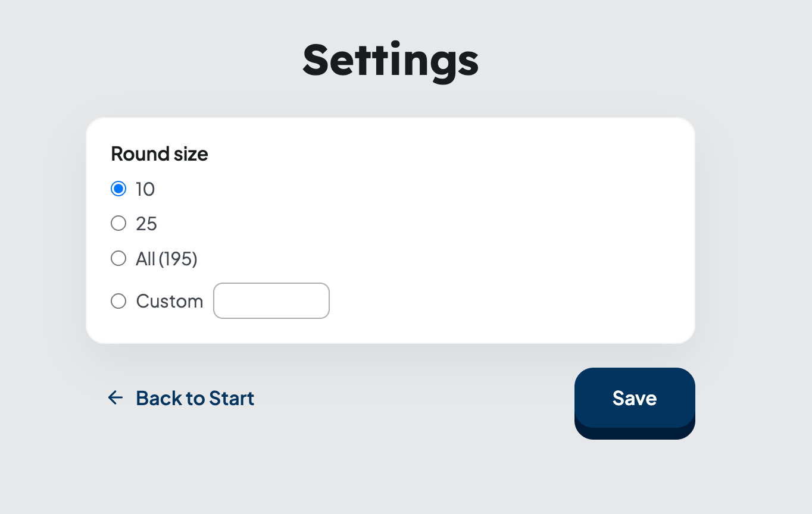

TODO:

- привести к единому виду все варианты написаний, например (ишью, issue) -> issue
- привести типографику к общему виду

## Введение

Главный тезис этой статьи простой: агент справляется там, где решения уже приняты и записаны, контекст каждой итерации мал, а состояние работы живёт вне агента — в issue-трекере или файлах, а не в его памяти.

## Workflow

Мой workflow по большей части основан на подходе [Mat Pocock](https://github.com/mattpocock) и его наборе скиллов: последовательность шагов от идеи до финального PR там уже заложена, я опираюсь на неё как есть.

Разберу каждый шаг на примере небольшого пет-проекта [geo-quiz](https://github.com/romankrru/geo-quiz). Стек у меня завязан на Claude Code и GitHub, но сами приёмы не про конкретный инструмент: их можно повторить с любым ИИ-агентом для работы с кодом (например, OpenCode) и с локальными файлами вместо GitHub issues.

Прежде чем разбирать каждый шаг — важная оговорка. Полный workflow я запускаю редко. Чаще беру отдельные скиллы и запускаю их вручную: так больше контроля, проще дебажить, видно, как всё устроено внутри, и легче адаптировать под себя. Если кусок неудобен — его не страшно заменить или выкинуть. Дальше я описываю максимальную версию пайплайна — каждая её часть работает и отдельно.

## Пример реализуемой фичи

В приложении нужно добавить экран настроек (`/settings`): игрок задаёт, количество вопросов в раунде — пресеты (10, 25, все страны каталога) или своё число; выбор сохраняется в `localStorage` и применяется при старте следующего раунда.



## Фиксация требований

TODO: кратко про /grill-with-docs, /grill-me

Я начинаю с разговора с агентом. Я описываю идею, вызываю скилл [/grill-with-docs](https://github.com/romankrru/geo-quiz/tree/main/.agents/skills/grill-with-docs) и далее агент выясняет у меня детали и фиксирует каждое значимое решение. Во время этой сессии агент параллельно правит [CONTEXT.md](https://github.com/romankrru/geo-quiz/blob/main/CONTEXT.md) в корне репозитория.

CONTEXT.md - это глоссарий проекта, в нем живут определения ключевых терминов проекта.
(_TODO: описать подробнее, как это связано с UL, это язык на котором мы говорим с доменным экспертом, затронуть DDD_). Такой документ убирает класс проблем, когда один и тот же концепт называется по разному.

TODO: Рассказать про CONTEXT-MAP.md

Еще добавляется docs/adr. (_TODO: что такое adr_). Таких документов сознательно мало, описываются только неочевидные решения и реальные trade-off-ы (TODO: подобрать слово), реализация не описывается.

На выходе в CONTEXT.md появляются новые термины, иногда создается новый ADR. Идея от смутной превращается в проговоренную.

### Создание PRD

TODO: кратко что такое PRD

PRD создается скиллом [/to-prd](https://github.com/romankrru/geo-quiz/tree/main/.agents/skills/to-prd) - это скилл не задает вопросы, он берет контекст чата и создает PRD по шаблону, а далее публикует его на Github. Пример такого PRD: [issue #13 — Configured round size (settings page)](https://github.com/romankrru/geo-quiz/issues/13).

На PRD-issue вешаются два лейбла, которые потом нужны для маршрутизации:

- `prd` — этот лейб получает только сам PRD-issue.
- `prd-<N>` где `<N>` — номер PRD-issue. Этот лейбл получает и сам PRD, и все его дочерние ишью.

Такая схема нужна, чтобы потом просто найти дочерние issue, которые относятся к PRD.

### Нарезка задач

Скилл [/to-issues](https://github.com/romankrru/geo-quiz/tree/main/.agents/skills/to-issues) разбивает большой PRD на небольшие задачи. Каждая из этих задач:

- Самодостаточная — можно взять, реализовать и смерджить.
- Это vertical slice (tracer bullet) — тонкий разрез через все слои (модель, сервис, UI, тесты), а не «весь backend сначала, потом весь frontend». (TODO: дать референс на то, что такое vertical slice или пояснить)
- Помечено как AFK (можно отдать агенту) или HITL (требует человека — например, дизайн-решение или архитектурный выбор).

Агент показывает мне предлагаемое разбиение, получает фидбек, итерирует и потом публикует дочерние issue на Github с лейблами `prd-N`, `ready-for-agent`.

Пример одного такого «ребёнка»: [issue #14 — Configured round size: Quiz preferences store and round-start resolution](https://github.com/romankrru/geo-quiz/issues/14).

После этого шага у меня в GitHub лежит: один PRD-issue, к нему привязаны несколько дочерних issue, у всех нужные лейблы.

### Ralph loop

Ralph — это очень простой цикл:

```sh
while not done:
    agent_step()
```

(TODO: описать почему такое название)
(TODO: найти более подходящее изображение, чтобы смотрелось норм на черном фоне)


У меня есть скрипт [`.agents/ralph/loop.sh`](https://github.com/romankrru/geo-quiz/blob/main/.agents/ralph/loop.sh), передает ему один и тот же [`PROMPT.md`](https://github.com/romankrru/geo-quiz/blob/main/.agents/ralph/PROMPT.md) и смотрит на последнюю строку вывода: `STATUS=done` | `STATUS=progress` | `STATUS=blocked`. По статусу решает: выходим или зовём агента снова.

Рядом с ним лежит [`loop-once.sh`](https://github.com/romankrru/geo-quiz/blob/main/.agents/ralph/loop-once.sh) — та же логика, но ровно одна итерация без цикла: запустил, посмотрел diff и логи, решил, что делать дальше. На практике им я пользуюсь чаще, чем полным `loop.sh` — это и есть «части вместо целого» из оговорки в начале.

(_TODO: кратко описать из чего состоит скрипт, зачем флаг `-p`, как запускать через `opencode run`_)

Принципиально важная деталь: между итерациями ralph ничего не помнит. Он берёт ровно один дочерний ишью и реализует его. На следующем шаге мы снова запускаем агента с пустым контекстом, он видит, что какие-то issue уже выполнены, он сам понимает приоритет, видит блокируемые ишью и выбирает самый подходящий ишью (TODO: криво написано)

Состояние я держу в GitHub: открытые/закрытые issue, лейблы, открытые/смердженные PR. Это «source of truth». Если ralph упал посреди работы — я просто запускаю его заново, он сам разберётся, на каком шаге продолжать.

Это не обязательно должен быть GitHub. То же самое легко собирается на локальных файлах: например, директория tasks/ с markdown-файлами, у каждого статус во frontmatter, и агент сканирует папку вместо gh issue list. Главное — состояние не в памяти агента, а в чём-то, что переживает перезапуск.

(TODO: добавить пример PRD.json / progress.txt)

Внутри каждой итерации ralph использует мой скилл implement-issue.

Этот скилл:

- Сверяется с CONTEXT.md и ADR’ами — чтобы названия в коде/коммитах/PR совпадали с доменом.
- Создаёт ветку ralph/<n>-<slug> от epic-ветки PRD (prd/<N>-<slug>), а не от main.
- Реализует ишью через TDD — это отдельный скилл [tdd](https://github.com/romankrru/geo-quiz/tree/main/.agents/skills/tdd). Используются vertical slice: один тест → минимальная имплементация → следующий тест. Acceptance criteria из тела ишью становятся списком тестов.
- Прогоняет локально lint, prettier, build, vitest.
- Открывает PR в epic-ветку с Closes #<n>.
- Передаёт PR скилу babysit (TODO: описать что это), который добивает его до зелёного CI и сквош-мержит в основную PRD-ветку.

Все child-PR’ы складываются на epic-ветку prd/<N>-<slug>. Финального мерджа в main ralph никогда не делает — это моя зона ответственности.

## Финальный PR в main

Когда ralph закрывает последнего ребёнка PRD, у меня в GitHub лежит один большой epic-PR prd/<N>-<slug> → main, состоящий из аккуратной серии сквош-коммитов «один коммит на ишью».

Пример итогового child-PR в epic: [PR #18 — Configured round size: Settings page and home navigation](https://github.com/romankrru/geo-quiz/pull/18).

Дальше — руками:

- Прохожу функциональность глазами и руками в браузере.
- Читаю diff целиком: меня интересует, как фича выглядит как единое целое
- C помощью агента делаю правки там, где агент срезал угол или повернул не туда
- После QA — мержу epic в main. GitHub автоматически закрывает все дочерние ишью по Closes #<n> и сам PRD.

## Что важно

(TODO: написать про важность небольшого контекста)

гент хорошо работает там, где решение уже принято и зафиксировано на бумаге. Если PRD сформулирован прицельно, домен зафиксирован в CONTEXT.md, ишью — это тонкий vertical slice с явными acceptance criteria — ralph справляется.
