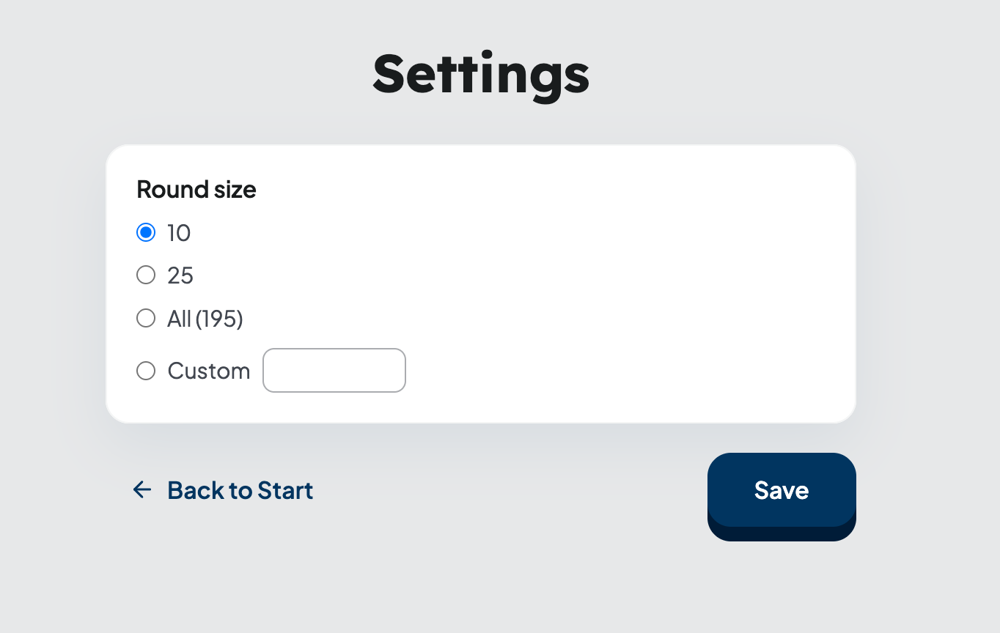

## Введение

Когда реализуешь большую фичу в одной чат-сессии, контекст быстро раздувается. По моим ощущениям, примерно после 100 тыс. токенов модели начинают хуже учитывать ранние договорённости и чаще ошибаются. Этот эффект называют _context rot_.

Агент лучше справляется с задачами, когда контекст каждой итерации мал, решения уже приняты и записаны, а состояние работы живёт вне агента — в issue-трекере или локальных файлах. Ниже — мой план-конспект, по которому можно провести фичу от идеи до pull request.

Подход рассчитан на большие фичи, которые нужно сначала обсудить и разбить на задачи. Для простого багфикса, исправления опечатки или мелкого рефакторинга нет смысла запускать весь цикл: обычно достаточно сразу поставить агенту задачу.

## Воркфлоу

Мой воркфлоу в основном основан на подходе [Мэтта Покока](https://github.com/mattpocock) и его наборе скиллов. В них уже заложена последовательность шагов от идеи до финального PR; я использую её почти без изменений.

Инструкция по установке скиллов есть в [руководстве Мэтта](https://github.com/mattpocock/skills#installation-30-second-setup).

Разберу каждый шаг на примере небольшого пет-проекта [geo-quiz](https://github.com/romankrru/geo-quiz). Я использую Claude Code и GitHub. Те же шаги можно повторить с другим ИИ-агентом, например OpenCode; задачи при этом можно хранить в локальных файлах вместо GitHub issues.

Я не всегда использую полный воркфлоу. Часто беру отдельные скиллы и запускаю их вручную — так у меня больше контроля над действиями агента. Если что-то ломается, проще отладить конкретный шаг.

## Фича для примера

В небольшой [игре-викторине по флагам](https://geo-quiz-phi.vercel.app/) нужно добавить экран настроек (`/settings`). Игрок выбирает количество вопросов в раунде: 10, 25, все страны из каталога или произвольное число. Выбор сохраняется в `localStorage` и применяется при старте следующего раунда.



## Фиксация требований

В наборе Мэтта Покока есть два связанных скилла:

- [`/grill-me`](https://github.com/mattpocock/skills/blob/main/skills/productivity/grill-me/SKILL.md) — агент подробно расспрашивает о фиче и помогает прояснить требования.
- [`/grill-with-docs`](https://github.com/mattpocock/skills/blob/main/skills/engineering/grill-with-docs/SKILL.md) — такое же интервью, но с учётом существующей доменной модели проекта. По ходу агент уточняет термины и записывает их в `CONTEXT.md`. При необходимости он оформляет архитектурные решения в ADR (_Architectural Decision Record_, запись об архитектурном решении).

Когда я начинаю работу над новой фичей, запускаю `/grill-with-docs`. Сначала появился `/grill-me` — скилл, который сам по себе стал вирусным. Позже Мэтт заметил, что им с агентом регулярно не хватает общего языка. В [DDD](https://en.wikipedia.org/wiki/Domain-driven_design) его называют _ubiquitous language_, или UL. На грилл-сессиях всплывали повторяющиеся термины, но их нигде не фиксировали, поэтому в следующий раз всё приходилось проговаривать заново. Сначала Мэтт параллельно запускал второй скилл, `/ubiquitous-language`, который собирал термины в отдельный глоссарий. Затем он объединил оба скилла — так появился `/grill-with-docs`.

В geo-quiz я описываю агенту идею и вызываю `/grill-with-docs`. Агент начинает выяснять детали и фиксировать значимые решения. Одновременно он обновляет [`CONTEXT.md`](https://github.com/romankrru/geo-quiz/blob/main/CONTEXT.md) в корне репозитория.

`CONTEXT.md` — глоссарий проекта с определениями ключевых терминов. В DDD есть понятие _ubiquitous language_ — общий язык разработчиков и доменных экспертов. Эти же термины используются в коде. Глоссарий помогает договориться о значении каждого понятия и последовательно использовать принятую терминологию.

Агент может свериться с `CONTEXT.md`, чтобы выяснить, что в проекте называют «раундом» или «пресетом». Эти определения помогают ему использовать принятую терминологию в коде и описании PR.

В разных частях проекта один термин может означать разные вещи. В DDD область, в которой действует определённая модель и её язык, называют _bounded context_. Для таких проектов Мэтт использует отдельные `CONTEXT.md`. В корне лежит `CONTEXT-MAP.md`, который описывает контексты проекта и указывает, где искать их глоссарии.

```
/
├── CONTEXT-MAP.md
├── docs/adr/                # системные решения
└── src/
    ├── ordering/
    │   ├── CONTEXT.md
    │   └── docs/adr/        # решения внутри контекста
    └── billing/
        ├── CONTEXT.md
        └── docs/adr/
```

Если термины имеют одинаковый смысл во всём проекте, достаточно одного `CONTEXT.md` в корне. Когда отдельным контекстам нужны свои глоссарии, `CONTEXT-MAP.md` помогает агенту и разработчику найти нужный.

Кроме `CONTEXT.md`, `/grill-with-docs` иногда предлагает создать ADR — отдельный Markdown-файл в `docs/adr/` с объяснением архитектурного решения. В ADR записывают, почему приняли решение и на какие компромиссы пошли. Это особенно полезно, если решение трудно отменить, а без контекста оно выглядит странно.

По моему опыту, ИИ может добавить в `CONTEXT.md` правдоподобный слоп. Поэтому разработчику нужно внимательно проверять этот этап. На код-ревью такой текст не всегда легко распознать, особенно если ревьюер плохо знаком с предметной областью.

## Создание PRD

Когда глоссарий устоялся, а спорные решения зафиксированы в ADR, идею можно оформить в формальный документ — PRD (_Product Requirements Document_).

PRD — короткий документ об одной фиче: её цели, сценариях использования, _scope_ (границах: что входит и что **не** входит) и _acceptance criteria_ (критериях приёмки). В отличие от `CONTEXT.md`, который описывает язык домена в целом, PRD всегда относится к конкретной фиче.

Скилл [`/to-prd`](https://github.com/romankrru/geo-quiz/tree/main/.agents/skills/to-prd) берёт контекст чата, оформляет PRD по шаблону и публикует его на GitHub. Пример такого документа: [issue № 13 — Configured round size (settings page)](https://github.com/romankrru/geo-quiz/issues/13).

Сам документ в репозитории не хранится — он существует только как GitHub issue. После создания PRD я поверхностно просматриваю результат. Мэтт в своём видео [говорит](https://youtu.be/-QFHIoCo-Ko?si=N152Z33k8J9LlNGP&t=2114), что не делает этого: по его словам, на этапе `/grill-with-docs` они с агентом уже договорились о главном, а PRD лишь фиксирует результат.

## Нарезка задач

Скилл [`/to-issues`](https://github.com/romankrru/geo-quiz/tree/main/.agents/skills/to-issues) разбивает большой PRD на небольшие задачи. Каждая из них:

- Самодостаточна: её можно взять, реализовать и смержить.
- Представляет собой _vertical slice_ (_tracer bullet_) — небольшой законченный кусок функциональности, например сохранение настройки вместе с интерфейсом, логикой и тестами. Его можно сразу проверить в работе. В _horizontal slice_ задача охватывает один технический слой, например весь бэкенд. Пользовательский сценарий получится проверить только после реализации остальных слоёв, поэтому для агента лучше использовать _vertical slice_.
- Помечена тегом AFK (можно отдать агенту) или <abbr title="Human-in-the-loop">HITL</abbr> (требует участия человека, например для принятия дизайнерского или архитектурного решения).

Агент показывает предлагаемое разбиение, получает обратную связь, уточняет его и затем публикует дочерние issues на GitHub с лейблом `ready-for-agent`. По этому лейблу их позже забирает Ralph loop.

Все issues, относящиеся к одному PRD, получают лейблы:

- `prd` — только сам PRD-issue.
- `prd-<N>`, где `<N>` — номер PRD-issue. Этот лейбл получают и сам PRD, и все его дочерние issues.

Такая схема позволяет одной выборкой найти все дочерние issues, относящиеся к PRD.

Пример одного такого «ребёнка»: [issue № 14 — Configured round size: Quiz preferences store and round-start resolution](https://github.com/romankrru/geo-quiz/issues/14).

После этого шага в GitHub есть один PRD-issue и несколько привязанных к нему дочерних issues с нужными лейблами.

## Ralph loop

Ralph loop — простой цикл:

```text
while not done:
    agent_step()
```

Название придумал [Джеффри Хантли](https://ghuntley.com/ralph/) — это отсылка к Ральфу Виггаму из «Симпсонов». Персонаж глуповат, но упорно пробует снова и не унывает из-за неудач. Цикл ведёт себя так же: на каждой итерации агент получает тот же промпт, но работает с изменившимся кодом. И так до тех пор, пока задача не будет закрыта.


У меня для этого есть скрипт [`.agents/ralph/loop.sh`](https://github.com/romankrru/geo-quiz/blob/main/.agents/ralph/loop.sh). Он по кругу запускает агента с одним и тем же [`PROMPT.md`](https://github.com/romankrru/geo-quiz/blob/main/.agents/ralph/PROMPT.md) и читает последнюю строку вывода: `STATUS=done`, `STATUS=progress` или `STATUS=blocked`. Затем по статусу решает, завершиться или запустить агента снова. В самом `PROMPT.md` описано, что агент должен сделать за один проход.

Скрипт принимает номер PRD-issue и переходит в корень репозитория. Затем он выполняет не больше `MAX_ITERS` итераций, по умолчанию 20. Вывод каждой итерации записывается в `.agents/ralph/logs/<timestamp>/iter-NN.log`. По последней строке `STATUS=…` скрипт решает, продолжать ли цикл.

Сам вызов агента:

```sh
claude \
  --allowed-tools=Bash,Read,Edit,Write,MultiEdit,Grep,Glob \
  -p "$PROMPT_BODY"
```

Флаг `-p` (он же `--print`) переводит Claude Code в headless-режим: агент печатает ответ в stdout и завершается, не запуская интерактивный TUI.

```text
~ ❯ claude -p "Hello, claude"
Hello! How can I help you today?
~ ❯
```

Без этого флага вызов из скрипта не имел бы смысла: TUI заблокировал бы пайплайн.

Если вместо Claude Code использовать [OpenCode](https://opencode.ai), строку нужно заменить на `opencode run "$PROMPT_BODY"`. Команда запускает такой же неинтерактивный режим: не ждёт ввода и автоматически подтверждает вызов инструментов. Остальная обвязка — логи, разбор `STATUS` и цикл — остаётся прежней.

Рядом с `loop.sh` лежит [`loop-once.sh`](https://github.com/romankrru/geo-quiz/blob/main/.agents/ralph/loop-once.sh) — почти такой же скрипт, но без внешнего цикла и флага `-p`. Агент запускается в обычном интерактивном TUI: я вижу, как он рассуждает, какие инструменты вызывает и где спотыкается. Это режим для наблюдения и настройки. На практике я пользуюсь им чаще, чем полным `loop.sh`. Это и есть «части вместо целого» из оговорки в начале статьи.

Между итерациями Ralph ничего не помнит. За один проход он берёт один дочерний issue и реализует его. Следующая итерация начинается с пустого контекста: агент перечитывает GitHub, проверяет, какие issues уже закрыты или заблокированы, и сам решает, что взять дальше.

Состояние хранится в GitHub: открытые и закрытые issues, лейблы, открытые и смерженные PR. GitHub служит единым источником истины. Если Ralph остановился посреди работы, его можно просто перезапустить: агент сам определит, с какого шага продолжать.

GitHub необязательно использовать как хранилище состояния. Задачи можно держать в локальном каталоге `tasks/` с Markdown-файлами, указывать статус во front matter и сканировать этот каталог вместо вызова `gh issue list`. Главное, чтобы состояние сохранялось вне памяти агента, в устойчивом хранилище, которое переживает перезапуск.

Внутри каждой итерации Ralph использует мой скилл [`implement-issue`](https://github.com/romankrru/geo-quiz/tree/main/.agents/skills/implement-issue).

Этот скилл:

- Сверяется с `CONTEXT.md` и файлами ADR, чтобы термины в коде, коммитах и PR соответствовали глоссарию.
- Создаёт ветку `ralph/<n>-<slug>` от PRD-ветки (`prd/<N>-<slug>`), а не от `main`.
- Реализует issue через TDD с помощью отдельного скилла [`tdd`](https://github.com/romankrru/geo-quiz/tree/main/.agents/skills/tdd). Работа идёт вертикальными срезами: один тест → минимальная реализация → следующий тест. Критерии приёмки из тела issue становятся списком тестов.
- Локально запускает `lint`, `prettier`, `build` и `vitest`.
- Открывает PR в PRD-ветку с `Closes #<n>`.
- Передаёт PR скиллу [`babysit`](https://github.com/openai/codex/blob/main/.codex/skills/babysit-pr/SKILL.md), который доводит CI до зелёного состояния и сквош-мержит PR в PRD-ветку.

Все дочерние PR сливаются в PRD-ветку `prd/<N>-<slug>`. Ralph никогда не мержит итоговый PR в `main` — это моя зона ответственности.

## Финальный PR в main

Когда Ralph завершает работу над последним дочерним issue, в GitHub остаётся один итоговый PR из `prd/<N>-<slug>` в `main`. Он содержит серию сквош-коммитов по принципу «один коммит на issue».

Пример дочернего PR в PRD-ветку: [PR № 18 — Configured round size: Settings page and home navigation](https://github.com/romankrru/geo-quiz/pull/18).

Дальше:

- Проверяю функциональность в браузере.
- Читаю diff целиком и проверяю, как фича выглядит как единое целое.
- Исправляю места, где агент срезал угол или повернул не туда.
- После QA мержу итоговый PR в `main`. GitHub автоматически закрывает дочерние issues по `Closes #<n>` и сам PRD.

## Если коротко

Полный путь от идеи до мержа в `main`:

1. **`/grill-with-docs`** — агент уточняет требования к фиче и записывает определения терминов в `CONTEXT.md`. При необходимости оформляет архитектурные решения в ADR.
2. **`/to-prd`** — собирает контекст чата в PRD и публикует его как GitHub issue с лейблом `prd`.
3. **`/to-issues`** — делит PRD на дочерние issues в формате _vertical slice_ и добавляет служебные лейблы `prd-<N>` и `ready-for-agent`.
4. **Ralph loop** — берёт issue с лейблом `ready-for-agent` и через `implement-issue` доводит его до PR в PRD-ветку; `babysit` исправляет CI и сквош-мержит PR.
5. **Финальный мерж** — я проверяю итоговый PR в браузере, читаю diff целиком, точечно исправляю ошибки и мержу его в `main`.

К моменту, когда Ralph берёт задачу, основные требования уже определены и записаны. Агенту проще понять, что нужно сделать, хотя результат всё равно приходится проверять и исправлять. Из всех опробованных мной вариантов этот подход работает лучше всего.
